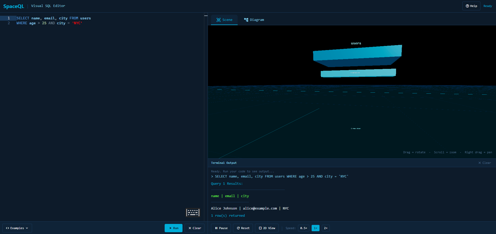

<!-- Interactive SQL Visualizer -->

# SpaceQL

Learn SQL by seeing it in action! [SpaceQL](https://spaceql.netlify.app/) is an interactive SQL visualizer that transforms your SQL queries into dynamic 3D animations. Whether you're a beginner trying to grasp the basics of SQL or an experienced developer looking for a new way to visualize your queries, SpaceQL provides an engaging and intuitive learning experience.



> In this versions animations are not look descriptive, but in the next versions we will add more descriptive animations to make it more intuitive and engaging. Stay tuned for updates! [Live Demo](https://spaceql.netlify.app/)

## Table of Contents

- [SpaceQL](#spaceql)
  - [Table of Contents](#table-of-contents)
  - [Built With](#built-with)
  - [Development Guide](#development-guide)
    - [1. Prerequisites](#1-prerequisites)
    - [2. Installation](#2-installation)
  - [Architecture](#architecture)
  - [Contributing](#contributing)
  - [Contact](#contact)

## Built With

- [Three.js](https://threejs.org/) - 3D visualization engine
- [GSAP 3](https://greensock.com/gsap/) - Animation library
- [Tailwind CSS](https://tailwindcss.com/) - Utility-first CSS framework
- [SQL.js](https://sql.js.org/) - SQLite engine for real SQL execution in browser
- [Vanilla ES6](https://developer.mozilla.org/en-US/docs/Web/JavaScript) - Pure JavaScript modules
- [Monaco Editor](https://microsoft.github.io/monaco-editor/) - Code editor with SQL syntax highlighting

## Development Guide

### 1. Prerequisites

To contribute to SpaceQL, you will need the following tools installed on your development machine:

- Python 3 or Node.js (for running a local development server)

### 2. Installation

To get started with SpaceQL, simply clone the repository and open the `index.html` file in your web browser. You can start typing SQL queries in the editor and see the visualizations in real-time.

```bash
# Move to your workspace
cd <your-workspace>

# Clone this project into your workspace
git clone <repository-url>

# Move to the project root directory
cd SpaceQL

# Open the project in your favorite IDE
code . # For Visual Studio Code

# Run a local server (Python 3)
python3 -m http.server 8080

# Run a local server (Node.js)
npx http-server -p 8080
```

Then, open your browser and go to `http://localhost:8080` to see SpaceQL in action.

> No Environment Variables, no API keys, no build steps. Just open the HTML file and start learning SQL visually!

## Architecture

The project is structured in a layered architecture with the following layers:

```bash
.
├── index.html              # Main application page
├── js/
│   ├── core/
│   │   ├── scene.js       # Three.js scene management
│   │   └── utils.js       # Utility functions
│   ├── data/
│   │   ├── examples.js    # SQL example queries
│   │   ├── sqlhelp.js     # SQL syntax definitions and autocomplete data
│   │   ├── suggestions.js # Monaco autocomplete definitions
│   │   └── tables.js      # Database schema definitions
│   ├── engine/
│   │   ├── parser.js      # SQL query parser
│   │   └── engine.js      # Visualization dispatcher
│   └── visualizers/
│       ├── base.js        # Base visualizer class
│       ├── select.js      # SELECT query visualizer
│       ├── insert.js      # INSERT query visualizer
│       ├── update.js      # UPDATE query visualizer
│       ├── delete.js      # DELETE query visualizer
│       └── create.js      # CREATE TABLE visualizer
└── docs/                  # Documentation and design assets
```

## Contributing

In the **SpaceQL** project, we follow a structured development workflow to ensure efficient collaboration and code management. This workflow includes the following key components: branching strategy, versioning, and commit message conventions. By following these guidelines, we aim to maintain a clean and organized codebase that is easy to manage and contribute to. For more information, please refer to the [Contributing Guide](CONTRIBUTING.md) document.

## Contact

Thanks to the following people who have contributed to this project:

- [Yunus Emre Alpu](https://www.linkedin.com/in/yunus-emre-alpu) - Creator and Maintainer
